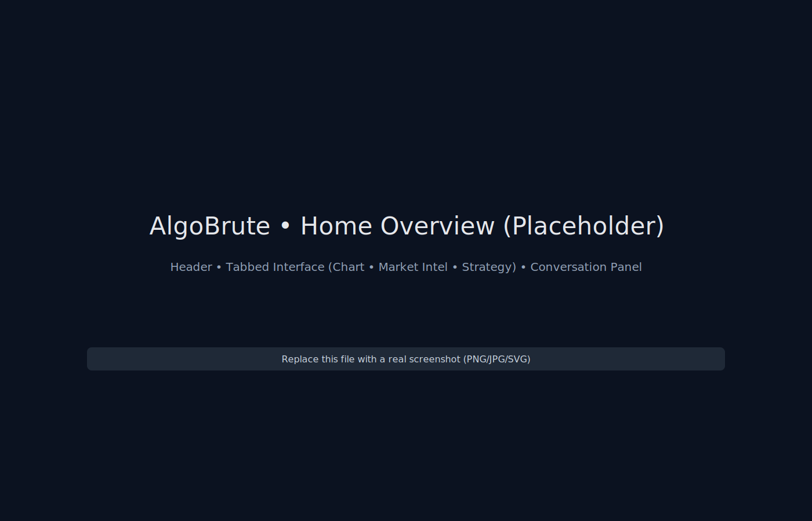
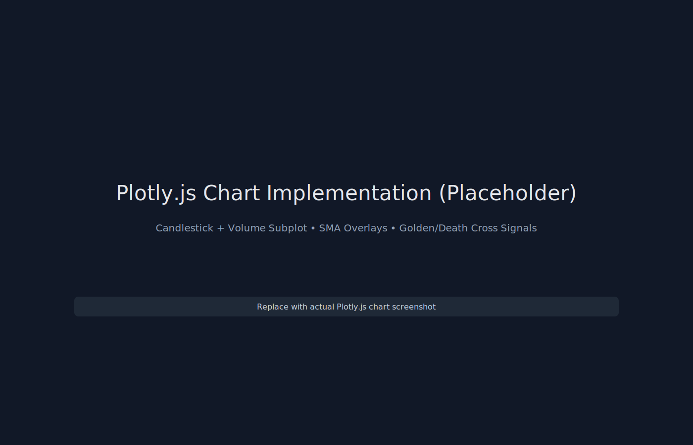
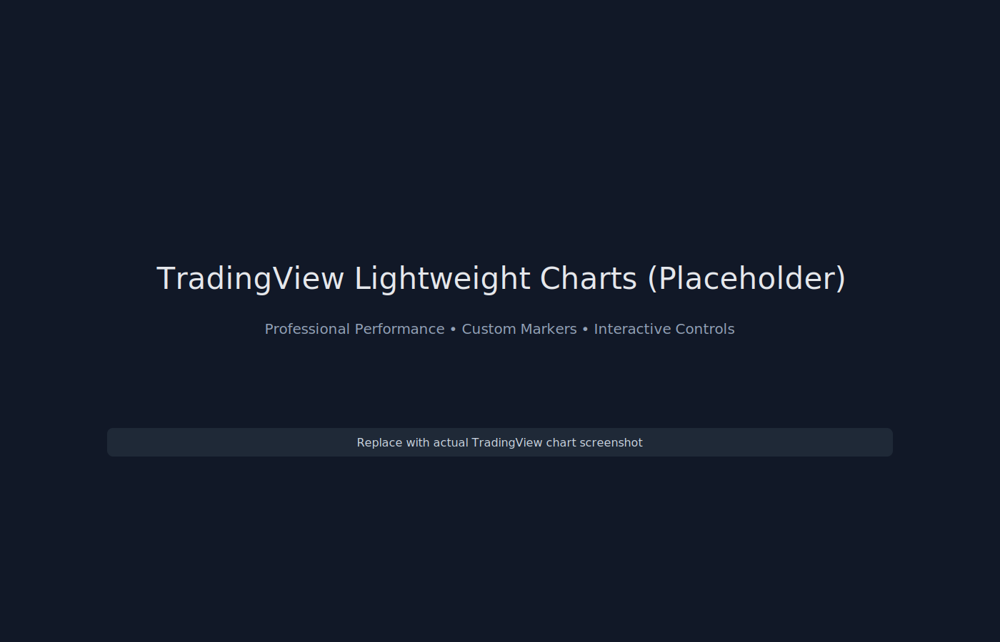
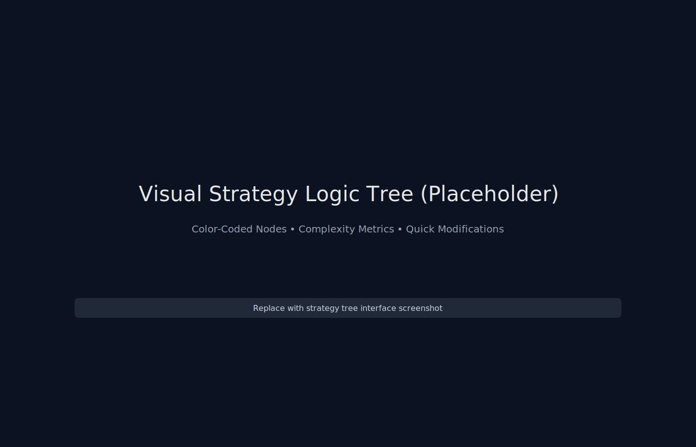
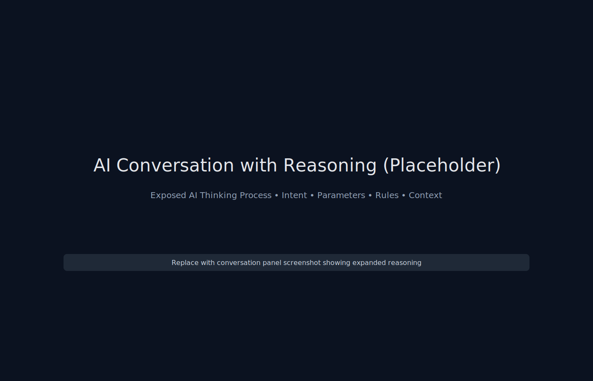
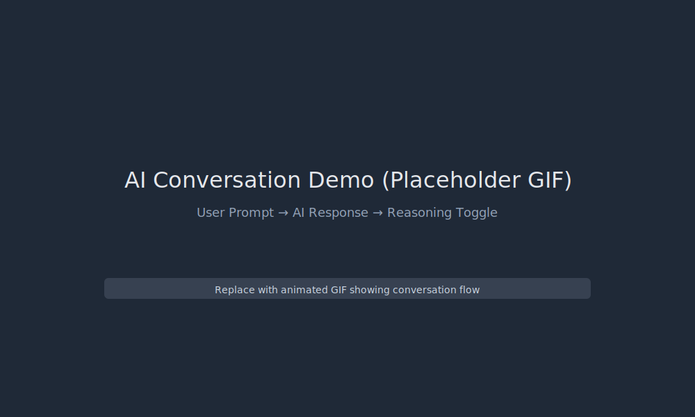
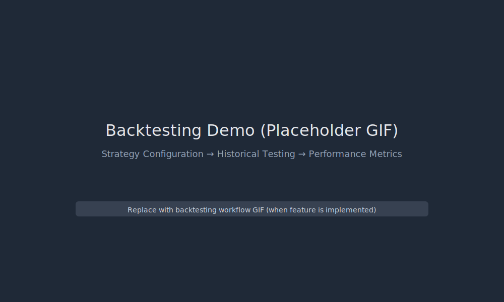

# AlgoBrute - AI-Powered Trading Strategy Generator


> **Democratizing algorithmic trading through conversational AI, real-time market data, and advanced visual strategy development**

AlgoBrute is a sophisticated web application that bridges the gap between trading intuition and technical implementation. It empowers retail traders to develop, visualize, backtest, and iterate on trading strategies using natural language conversation with AI, professional-grade charting tools, and real-time market intelligence.

## 🎯 **Key Features & Capabilities**

### ✨ **AI-Powered Strategy Development**
- **Dual LLM Architecture**: Choose between **OpenAI GPT-4 Turbo** and **xAI Grok-2**
- **Exposed AI Reasoning**: Transparent "thinking process" with collapsible reasoning sections showing:
  - Intent understanding and parameter identification
  - Rule formulation and market context synthesis
  - Strategy optimization recommendations
- **Iterative Conversation**: Natural language refinement with full conversation history
- **Context Preservation**: Maintains strategy state across multiple iterations
- **Quick Actions**: Pre-built suggestions for common strategy modifications

### 📊 **Advanced Charting & Visualization**
- **Dual Chart Engine**: Both **TradingView Lightweight Charts** and **Plotly.js** implementations
- **Real-Time Market Data**: Yahoo Finance integration with automatic fallback to mock data
- **Professional Indicators**: SMA (20/50), Volume analysis, Custom signal overlays
- **Interactive Controls**: Multiple timeframes (1D, 1W, 1M, 3M, 6M, YTD, 1Y, 5Y)
- **Signal Generation**: Automated buy/sell signals based on SMA crossovers (Golden/Death Cross)
- **Dynamic Markers**: Visual buy/sell arrows with price and reasoning tooltips

### 🌳 **Visual Strategy Logic Trees**
- **Node-Based Representation**: Hierarchical strategy visualization similar to Composer.trade
- **Color-Coded Components**: 
  - **Blue**: Conditions and logic operators
  - **Green**: Buy actions and bullish signals  
  - **Red**: Sell actions and bearish signals
  - **Gray**: Technical indicators and data sources
- **Interactive Modifications**: Quick-action buttons for common strategy enhancements
- **Complexity Analysis**: Real-time assessment of strategy sophistication
- **Performance Metrics**: Rule count, condition complexity, indicator usage

### 💡 **Comprehensive Market Intelligence**
- **Multi-Tab Interface**: Company fundamentals, news feed, technical analysis
- **Real-Time Data**: Stock price, volume, market cap, P/E ratios, beta analysis
- **News Integration**: Sentiment-analyzed news feed with AI-powered scoring
- **Technical Indicators**: RSI, MACD, Stochastic with AI-generated recommendations
- **Risk Assessment**: Volatility analysis, trend strength, liquidity evaluation
- **Strategy Impact**: Real-time assessment of how market conditions affect strategy performance

### 🔄 **Robust Data Infrastructure**
- **Multi-Source Integration**: Yahoo Finance (primary), Alpha Vantage, Twelve Data (planned)
- **Intelligent Caching**: 5-minute TTL with automatic refresh for optimal performance
- **Graceful Fallbacks**: Sophisticated mock data generation when APIs unavailable
- **CORS Handling**: Proxy integration for browser-based financial data access
- **Rate Limiting**: Smart request management to stay within API quotas

## 🏗 **Technology Stack & Architecture**

### **Frontend Technologies**
- **Framework**: Next.js 15.5.4 with App Router and Turbopack
- **UI Library**: React 19.1.0 with TypeScript 5.0+
- **Styling**: Tailwind CSS 4.0 with custom trading theme
- **Components**: shadcn/ui with Radix UI primitives
- **Icons**: Lucide React with 500+ trading-specific icons
- **State Management**: Zustand for global state, React Context for local state
- **Charts**: Dual implementation with TradingView Lightweight Charts 4.2.0 and Plotly.js 3.1.1
- **Data Fetching**: SWR 2.3.6 with intelligent caching and automatic revalidation

### **Backend & Data Services**
- **API Integration**: Axios 1.12.2 with proxy support for CORS handling
- **Market Data**: Yahoo Finance (primary), Alpha Vantage integration
- **AI Services**: OpenAI SDK 6.0.0, xAI Grok API support
- **Real-Time Data**: Custom service layer with 5-minute caching TTL
- **Flow Diagrams**: ReactFlow (@xyflow/react) for interactive strategy trees

### **Development & Build Tools**
- **Build System**: Next.js with Turbopack for fast development builds
- **Linting**: ESLint 9.0 with Next.js configuration
- **Type Checking**: TypeScript with strict mode enabled
- **Package Manager**: npm with lock file for consistent dependencies
- **CSS Processing**: PostCSS with Tailwind CSS autoprefixer

### **Application Architecture**

```
algobrute/
├── src/
│   ├── app/                    # Next.js App Router
│   │   ├── layout.tsx          # Root layout with providers
│   │   ├── page.tsx            # Main application page
│   │   └── globals.css         # Global styles & Tailwind
│   ├── components/             # React components
│   │   ├── ui/                 # shadcn/ui base components
│   │   ├── layout/             # Layout components
│   │   │   ├── StrategyHeader.tsx
│   │   │   ├── TabbedInterface.tsx
│   │   │   └── ActionBar.tsx
│   │   ├── chart/              # Charting components
│   │   │   ├── ChartPanel.tsx          # Plotly.js implementation
│   │   │   └── ChartPanel_TradingView.tsx  # TradingView implementation
│   │   ├── conversation/       # AI chat interface
│   │   ├── strategy/           # Strategy tree visualization
│   │   ├── info/              # Market intelligence panels
│   │   └── ai/                # LLM provider selection
│   ├── lib/                   # Core services & utilities
│   │   ├── dataService.ts     # Mock data service
│   │   ├── realDataService.ts # Real market data API
│   │   └── utils.ts           # Shared utilities
│   └── utils/                 # Helper functions
│       └── chartUtils.ts      # TradingView chart utilities
└── reference_assets/          # Development reference materials
```

## 🚀 **Quick Start Guide**

### **Prerequisites**
- **Node.js** 18.17+ or 20.0+ (LTS recommended)
- **npm** 9.0+ or **yarn** 1.22+
- **Modern Browser** with ES2017+ support

### **Installation**

```bash
# Clone the repository (if applicable)
git clone <repository-url>
cd algobrute

# Install dependencies
npm install

# Set up environment variables (optional for development)
cp .env.local.example .env.local

# Start development server with Turbopack
npm run dev
```

**🌐 Access the application**: Navigate to `http://localhost:3000`

### **Environment Configuration**

Create a `.env.local` file for API integrations (optional):

```bash
# LLM Provider API Keys
OPENAI_API_KEY=your_openai_api_key_here
GROK_API_KEY=your_grok_api_key_here

# Financial Data API Keys  
ALPHA_VANTAGE_API_KEY=your_alpha_vantage_key_here
TWELVE_DATA_API_KEY=your_twelve_data_key_here

# Application Configuration
NEXT_PUBLIC_APP_ENV=development
NEXT_PUBLIC_DATA_REFRESH_INTERVAL=300000  # 5 minutes
NEXT_PUBLIC_ENABLE_MOCK_DATA=true
```

**✅ No API Keys Required**: AlgoBrute includes sophisticated mock data generation and works fully without external API keys for development and testing.

## ✨ **Current Implementation Status**

### ✅ **Completed Features**

#### **Core Application Infrastructure**
- [x] **Next.js 15 Foundation**: Full App Router implementation with Turbopack
- [x] **TypeScript Integration**: Strict type checking with comprehensive interfaces
- [x] **Tailwind CSS 4.0**: Custom trading-optimized dark theme with CSS variables
- [x] **Responsive Layout**: 3-column desktop layout with mobile considerations
- [x] **Component Architecture**: shadcn/ui integration with custom trading components

#### **AI-Powered Conversation Interface**
- [x] **Message Management**: Full conversation history with user/AI threading
- [x] **Exposed AI Reasoning**: Collapsible thinking process sections showing:
  - Intent understanding and parameter identification
  - Rule formulation and market context synthesis 
  - Strategy optimization recommendations
- [x] **Quick Action Suggestions**: Pre-built buttons for common modifications
- [x] **LLM Provider Selection**: UI for choosing between OpenAI and Grok
- [x] **Token Usage Tracking**: Real-time cost estimation and usage monitoring

#### **Advanced Charting System**
- [x] **Dual Chart Implementation**: 
  - **Plotly.js**: Professional candlestick charts with subplots
  - **TradingView Lightweight Charts**: Ultra-performance trading charts
- [x] **Real-Time Market Data**: Yahoo Finance integration with CORS proxy
- [x] **Technical Indicators**: SMA 20/50 with crossover signal generation
- [x] **Interactive Controls**: 8 timeframes (1D to 5Y) with dynamic data loading
- [x] **Volume Analysis**: Integrated volume bars with color coding
- [x] **Trading Signals**: Automated Golden/Death Cross detection with visual markers
- [x] **Fallback System**: Intelligent mock data when APIs unavailable

#### **Visual Strategy Trees**
- [x] **Node-Based Visualization**: Hierarchical strategy representation
- [x] **Color-Coded Logic**: Blue conditions, green buy actions, red sell actions
- [x] **Interactive Components**: Expandable/collapsible strategy nodes
- [x] **Complexity Metrics**: Real-time strategy sophistication assessment
- [x] **Quick Modifications**: One-click enhancements (stop-loss, volume filters, etc.)
- [x] **Performance Summary**: Rule count, condition analysis, indicator usage

#### **Market Intelligence Dashboard**
- [x] **Multi-Tab Interface**: Company fundamentals, news, technical analysis
- [x] **Real-Time Stock Info**: Price, change, volume, market cap display
- [x] **Company Metrics**: P/E ratio, EPS, dividend yield, beta analysis
- [x] **News Integration**: Sentiment-analyzed feed with AI scoring
- [x] **Technical Analysis**: RSI, MACD, Stochastic with recommendations
- [x] **Risk Assessment**: Volatility, trend strength, liquidity evaluation

#### **Data Services & Infrastructure**
- [x] **Caching System**: 5-minute TTL with intelligent cache invalidation
- [x] **API Integration**: Yahoo Finance with proxy for CORS handling
- [x] **Error Handling**: Graceful degradation with informative user feedback
- [x] **Mock Data Generation**: Sophisticated fallbacks with realistic market behavior
- [x] **Performance Optimization**: Memoized components and efficient re-rendering

### 🚧 **In Development**
- [ ] **Live AI Integration**: Connect conversation panel to OpenAI/Grok APIs
- [ ] **Real-Time Streaming**: WebSocket connections for live market updates
- [ ] **Strategy Backtesting**: Historical performance analysis with VectorBT integration
- [ ] **Parameter Optimization**: Automated testing of strategy variations
- [ ] **Export Capabilities**: PDF reports and CSV data downloads

## 💰 **Cost Analysis & API Integration**

### **LLM Providers**
| Provider | Model | Input Cost | Output Cost | Speed | Best Use Case |
|----------|-------|------------|-------------|-------|---------------|
| **OpenAI** | GPT-4 Turbo | $0.01/1K tokens | $0.03/1K tokens | Fast | Complex reasoning, strategy analysis |
| **xAI** | Grok-2** | $0.002/1K tokens | $0.010/1K tokens | Ultra Fast | Real-time market insights, quick responses |

### **Financial Data Sources**
| Provider | Free Tier | Data Delay | Rate Limits | Integration Status |
|----------|-----------|------------|-------------|-------------------|
| **Yahoo Finance** | Unlimited | 15-20 min | ~2000 req/hour | ✅ **Active** |
| **Alpha Vantage** | 25 requests/day | 15-20 min | 5 calls/min | 🚧 **Planned** |
| **Twelve Data** | 800 requests/day | 15-20 min | 8 calls/min | 🚧 **Planned** |
| **Mock Data** | Unlimited | Real-time | No limits | ✅ **Active** |

**Estimated Monthly Operating Cost**: $5-20 for typical usage (including AI inference and premium data feeds)

### **API Configuration Requirements**

```bash
# Required for AI features
OPENAI_API_KEY=sk-...                    # GPT-4 access
GROK_API_KEY=grok-...                   # Grok-2 access

# Optional for enhanced data
ALPHA_VANTAGE_API_KEY=your_key          # Premium financial data
TWELVE_DATA_API_KEY=your_key           # Alternative data source

# Application settings
NEXT_PUBLIC_ENABLE_MOCK_DATA=true       # Fallback to mock data
NEXT_PUBLIC_DATA_REFRESH_INTERVAL=300   # 5-minute cache TTL
```

## 📊 **Advanced Charting Implementation**

AlgoBrute features a **dual charting system** offering the best of both worlds:

### **TradingView Lightweight Charts Integration**
✅ **Professional Performance**: Canvas-based rendering with 60fps smooth interactions  
✅ **Custom Signal Markers**: Advanced buy/sell arrows with price labels and reasoning  
✅ **Technical Indicators**: SMA 20/50 overlays with crossover detection  
✅ **Volume Integration**: Separate subplot with color-coded volume bars  
✅ **Interactive Controls**: Full zoom, pan, crosshair, and timeframe navigation  
✅ **Mobile Responsive**: Touch-optimized interactions for mobile trading  

### **Plotly.js Professional Charts**
✅ **Advanced Visualizations**: Multi-subplot layouts with synchronized time axes  
✅ **Real-Time Data Integration**: Live updates with Yahoo Finance API  
✅ **Golden/Death Cross Detection**: Automated signal generation with SMA crossovers  
✅ **Interactive Legends**: Toggle indicators and customize display options  
✅ **Export Capabilities**: Built-in PNG/SVG export for strategy documentation  
✅ **Hover Analytics**: Detailed OHLCV information with signal explanations  

### **Implementation Examples**

```typescript
// TradingView Lightweight Charts Setup
import { createChart } from 'lightweight-charts';

const chart = createChart(container, {
  layout: { background: { color: '#111827' }, textColor: '#e5e7eb' },
  grid: { vertLines: { color: '#374151' }, horzLines: { color: '#374151' } },
  timeScale: { borderColor: '#4b5563', timeVisible: true },
  rightPriceScale: { borderColor: '#4b5563', borderVisible: true }
});

// Add candlestick series with custom styling
const candlestickSeries = chart.addCandlestickSeries({
  upColor: '#22c55e', downColor: '#ef4444',
  borderUpColor: '#22c55e', borderDownColor: '#ef4444'
});

// Generate and add trading signals
const signals = generateTradingSignals(data);
const markers = signals.map(signal => ({
  time: signal.time,
  position: signal.type === 'buy' ? 'belowBar' : 'aboveBar',
  color: signal.type === 'buy' ? '#22C55E' : '#EF4444',
  shape: signal.type === 'buy' ? 'arrowUp' : 'arrowDown',
  text: `${signal.type.toUpperCase()} @ ${formatPrice(signal.price)}`
}));
candlestickSeries.setMarkers(markers);
```

```typescript
// Plotly.js Advanced Chart Configuration
const plotlyConfig = {
  data: [
    // Candlestick trace
    {
      type: 'candlestick',
      x: data.map(d => d.time),
      open: data.map(d => d.open),
      high: data.map(d => d.high), 
      low: data.map(d => d.low),
      close: data.map(d => d.close),
      name: 'AAPL',
      yaxis: 'y'
    },
    // Volume subplot
    {
      type: 'bar',
      x: data.map(d => d.time),
      y: data.map(d => d.volume),
      name: 'Volume',
      yaxis: 'y2',
      marker: {
        color: data.map(d => d.close >= d.open ? '#22c55e' : '#ef4444')
      }
    },
    // SMA indicators with crossover detection
    ...generateSMATraces(data)
  ],
  layout: {
    yaxis: { domain: [0.25, 1] },      // Price chart (75% height)
    yaxis2: { domain: [0, 0.2] },      // Volume chart (20% height)
    plot_bgcolor: '#111827',
    paper_bgcolor: '#111827'
  }
};
```

## 🔮 **Future Roadmap & Planned Features**

### **Phase 1: AI Integration & Real-Time Data** ⏱️ *Q4 2025*
- [ ] **Live AI Conversation**: Connect to OpenAI GPT-4 and xAI Grok APIs
- [ ] **Streaming Responses**: Real-time token streaming with typing indicators
- [ ] **Context Management**: Persistent conversation history with strategy state
- [ ] **WebSocket Integration**: Live market data updates and price feeds
- [ ] **Enhanced Error Handling**: Comprehensive API error recovery

### **Phase 2: Advanced Strategy Engine** 🚀 *Q1 2026*
- [ ] **Custom Indicator Builder**: User-defined technical indicators with visual editor
- [ ] **Strategy Parameter Optimization**: Automated hyperparameter tuning
- [ ] **Multi-Asset Support**: Extend beyond single stocks to portfolios
- [ ] **Risk Management**: Advanced position sizing and stop-loss integration
- [ ] **Alert System**: Email/SMS notifications for strategy triggers

### **Phase 3: Backtesting & Analytics** 📊 *Q2 2026*

#### **VectorBT Integration Options**

**Option A: FastAPI Backend** (Recommended)
```python
# backend/backtesting/main.py
import vectorbt as vbt
from fastapi import FastAPI, HTTPException
from pydantic import BaseModel

app = FastAPI()

class StrategyConfig(BaseModel):
    signals: dict
    parameters: dict
    timeframe: str

@app.post("/backtest")
async def run_backtest(strategy: StrategyConfig):
    try:
        # Load historical data
        data = fetch_historical_data(strategy.timeframe)
        
        # Execute vectorBT backtesting
        portfolio = vbt.Portfolio.from_signals(
            data['Close'], 
            strategy.signals['buy'], 
            strategy.signals['sell'],
            init_cash=10000,
            fees=0.001  # 0.1% trading fees
        )
        
        return {
            "total_return": portfolio.total_return(),
            "sharpe_ratio": portfolio.sharpe_ratio(),
            "max_drawdown": portfolio.max_drawdown(),
            "win_rate": portfolio.trades.win_rate,
            "trade_count": portfolio.trades.count
        }
    except Exception as e:
        raise HTTPException(status_code=400, detail=str(e))
```

**Option B: Browser-Based Backtesting**
```typescript
// lib/backtesting/engine.ts
import { Strategy, MarketData, BacktestResult } from './types';

export class BacktestEngine {
  async runBacktest(
    strategy: Strategy, 
    data: MarketData[], 
    config: BacktestConfig
  ): Promise<BacktestResult> {
    const signals = this.generateSignals(strategy, data);
    const trades = this.executeTrades(signals, data, config);
    
    return {
      totalReturn: this.calculateTotalReturn(trades),
      sharpeRatio: this.calculateSharpeRatio(trades),
      maxDrawdown: this.calculateMaxDrawdown(trades),
      winRate: this.calculateWinRate(trades),
      equityCurve: this.generateEquityCurve(trades)
    };
  }
}
```

### **Phase 4: User Experience & Collaboration** 👥 *Q3 2026*
- [ ] **User Accounts**: Authentication with strategy cloud sync
- [ ] **Strategy Library**: Public/private strategy sharing platform
- [ ] **Social Features**: Community ratings, comments, and discussions
- [ ] **Mobile App**: React Native implementation for mobile trading
- [ ] **API Access**: Public API for third-party integrations

### **Phase 5: Enterprise & Scale** 🏢 *2027+*
- [ ] **Institutional Features**: Multi-user organizations and team collaboration
- [ ] **Advanced Analytics**: Portfolio optimization and risk analytics
- [ ] **Real Trading Integration**: Paper trading and broker API connections
- [ ] **Market Making**: Advanced order types and execution algorithms
- [ ] **Regulatory Compliance**: SEC/FINRA compliance features

## 🛠️ **Development & Contributing**

### **Development Scripts**

```bash
# Development
npm run dev          # Start development server with Turbopack
npm run build        # Build for production with optimizations
npm run start        # Start production server

# Code Quality
npm run lint         # Run ESLint with Next.js configuration
npx tsc --noEmit     # TypeScript type checking without build

# Dependencies
npm install          # Install all dependencies
npm update           # Update to latest compatible versions
npm audit            # Security vulnerability audit
```

### **Development Guidelines**

#### **Code Style & Patterns**
- **TypeScript First**: Strict typing with comprehensive interfaces
- **Component Structure**: Follow Next.js 15 App Router conventions
- **State Management**: Use Zustand for global state, React Context for component trees
- **Styling**: Tailwind CSS utility-first with custom CSS variables for theming
- **Icons**: Lucide React with consistent 4x4 or 5x5 sizing

#### **Performance Considerations**
- **Code Splitting**: Dynamic imports for heavy components (Plotly, TradingView)
- **Memoization**: React.memo for expensive re-renders, useMemo for calculations
- **Caching**: SWR for data fetching with intelligent cache invalidation
- **Bundle Size**: Regular audit with `npm run build` to monitor bundle growth

#### **Testing Strategy** (Planned)
- **Unit Tests**: Jest + Testing Library for component behavior
- **Integration Tests**: API mocking and service layer testing
- **E2E Tests**: Playwright for critical user journeys
- **Performance Tests**: Lighthouse CI for regression monitoring

### **Project Structure Deep Dive**

```bash
algobrute/
├── src/
│   ├── app/
│   │   ├── layout.tsx          # Root layout with theme providers
│   │   ├── page.tsx            # Main application SPA
│   │   └── globals.css         # Tailwind + custom CSS variables
│   │
│   ├── components/
│   │   ├── ui/                 # shadcn/ui base components
│   │   │   ├── button.tsx         # Custom button with trading variants
│   │   │   ├── card.tsx           # Container components
│   │   │   └── ...                # Other UI primitives
│   │   │
│   │   ├── layout/             # Application layout
│   │   │   ├── StrategyHeader.tsx  # Top navigation with metrics
│   │   │   ├── TabbedInterface.tsx # Main tabbed content area
│   │   │   └── ActionBar.tsx      # Bottom action controls
│   │   │
│   │   ├── chart/              # Dual charting system
│   │   │   ├── ChartPanel.tsx          # Plotly.js implementation
│   │   │   └── ChartPanel_TradingView.tsx  # TradingView Lightweight Charts
│   │   │
│   │   ├── conversation/       # AI chat interface
│   │   │   └── ConversationPanel.tsx   # Full conversation UI with reasoning
│   │   │
│   │   ├── strategy/           # Strategy visualization
│   │   │   └── StrategyTreePanel.tsx   # Interactive strategy trees
│   │   │
│   │   ├── info/              # Market intelligence
│   │   │   └── InfoPanel.tsx          # Multi-tab market data
│   │   │
│   │   └── ai/                # LLM integration
│   │       └── LLMProviderSelector.tsx # Provider switching UI
│   │
│   ├── lib/                   # Core services
│   │   ├── dataService.ts     # Mock data service
│   │   ├── realDataService.ts # Yahoo Finance integration
│   │   └── utils.ts           # Shared utility functions
│   │
│   └── utils/                 # Helper utilities
│       └── chartUtils.ts      # TradingView chart configuration
│
├── reference_assets/          # Development reference materials
│   └── ...                    # Prototyping assets and mockups
│
├── package.json              # Dependencies and scripts
├── next.config.ts           # Next.js configuration
├── tailwind.config.ts       # Tailwind CSS configuration
├── tsconfig.json           # TypeScript configuration
└── .env.local.example      # Environment variable template
```

## 👨‍💻 **Contributing**

### **Getting Started with Development**
1. **Fork** the repository and clone locally
2. **Install dependencies**: `npm install`
3. **Set up environment**: Copy `.env.local.example` to `.env.local`
4. **Start development**: `npm run dev`
5. **Make changes** and test thoroughly
6. **Submit PR** with clear description and screenshots

### **Areas for Contribution**
- 🤖 **AI Integration**: Connect live APIs for OpenAI and Grok
- 📊 **Advanced Indicators**: RSI, MACD, Bollinger Bands implementation
- 💰 **Backtesting Engine**: VectorBT integration or pure JS implementation
- 📱 **Mobile Optimization**: Responsive design improvements
- 🎭 **Testing**: Unit tests, integration tests, E2E testing
- 📝 **Documentation**: Component documentation, API guides

---

## 🚀 **About AlgoBrute**

**AlgoBrute** represents the future of retail algorithmic trading - a sophisticated yet accessible platform that democratizes quantitative finance through the power of conversational AI and cutting-edge web technologies.

### **Vision**
To bridge the gap between trading intuition and technical execution, empowering the next generation of retail traders with institutional-quality tools and AI-driven insights.

### **Mission**
Democratizing algorithmic trading by making strategy development as simple as having a conversation, while maintaining the depth and sophistication required for serious trading.

---

**Built with ♥️ by the AlgoBrute team**

[](https://nextjs.org/)
[](https://openai.com)
[](https://tradingview.github.io/lightweight-charts/)
[](https://plotly.com/javascript/)

## 🖼️ **Screenshots & Demos**

> Note: The following assets are placeholders. Replace them with real screenshots/GIFs in `reference_assets` to keep the README visually up to date.

### Screenshots
- Home Overview  
  
- Plotly.js Chart (Candlestick + Volume + SMA)  
  
- TradingView Lightweight Charts  
  
- Strategy Logic Tree  
  
- Conversation with Exposed Reasoning  
  

### Demos
- AI Conversation Demo (placeholder)  
  
- Backtesting Flow (placeholder)  
  

---

*Last Updated: October 2025 • Version 0.2.0 • © 2025 AlgoBrute Project*
